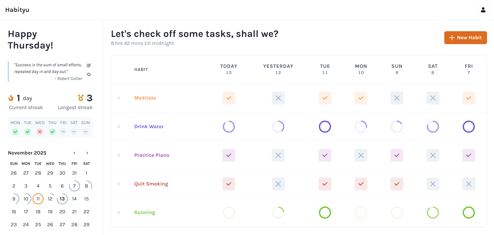
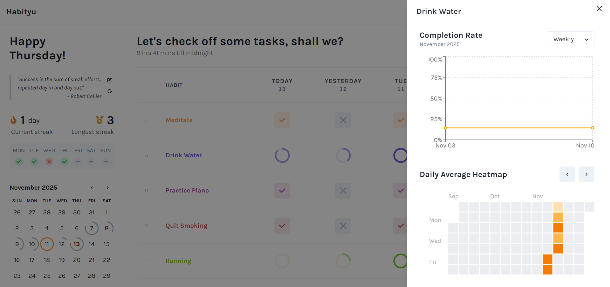

# Habityu - Personal Habit Tracker

A full-stack habit tracking web application built with FastAPI backend and React frontend, featuring: comprehensive analytics, AI-powered motivational quotes and more.

# Previews



## Features

- **Habit Management:** Create, update, delete, and track habits with customizable types (checkbox/measurable)
- **Progress Tracking:** Visual heatmaps, charts, and statistics for habit completion
- **Streak Tracking:** Current and longest streak calculation
- **AI-Powered Quotes:** Personalized motivational quotes based on your habits
- **PDF Reports:** Export detailed habit insights as PDF
- **Rate Limiting:** API protection with configurable rate limits
- **Responsive Design:** Mobile-friendly interface with Chakra UI


## Tech Stack

- **Backend:** FastAPI, SQLAlchemy, SQLite, Alembic
- **Frontend:** React, Vite, Chakra UI, Recharts, Axios
- **AI Integration:** OpenRouter API

## Environment Variables

Create a `.env` file in the backend root directory with the following variables:

```env
OPENROUTER_API_KEY=your_openrouter_api_key_here
OPENROUTER_MODEL=your_model_name
OPENROUTER_URL=https://openrouter.ai/api/v1/chat/completions

VITE_API_BASE_URL=https://your-backend-domain.com
FRONTEND_URL=https://your-frontend-domain.com
LOCAL_CORS_ORIGIN=http://localhost:5173
```

### Environment Variable Descriptions

| Variable | Description                                                      |
|----------|------------------------------------------------------------------|
| `OPENROUTER_API_KEY` | API key for OpenRouter AI service (used for motivational quotes) |
| `OPENROUTER_MODEL` | Model name to use for AI quote generation                        |
| `OPENROUTER_URL` | OpenRouter API endpoint URL                                      |
| `VITE_API_BASE_URL` | Production backend URL                                           |
| `FRONTEND_URL` | Production frontend URL                                          |
| `LOCAL_CORS_ORIGIN` | Local development frontend URL                                   |

## Backend Setup

### Installation

```bash
# Go to backend directory
cd backend

# Create virtual environment
python -m venv venv

# Activate virtual environment
venv\Scripts\activate

# Install dependencies
pip install requirements.txt
```

### Database Setup

```bash
# Initialize Alembic migrations
alembic init alembic

# Run migrations to create database
alembic upgrade head
```

### Running the Backend

```bash
# For Development
uvicorn backend.app.main:app --reload --host 0.0.0.0 --port 8000

# For Production
uvicorn backend.app.main:app --host 0.0.0.0 --port 8000
```

The API will be available at `http://localhost:8000`

## Frontend Setup

### Installation

```bash
# Go to frontend directory
cd frontend

# Install dependencies
npm install
```

### Running the Frontend

```bash
# For Development
npm run dev

# For Production
npm run build
```

The frontend will be available at `http://localhost:5173`

## API Endpoints

### Base URL
```
http://localhost:8000/api
```

### Health Check

| Method | Endpoint | Description |
|--------|----------|-------------|
| GET | `/health` | Check API health status |

**Response:**
```json
{
  "status": "healthy",
  "message": "Habityu API is running."
}
```

### Habits

| Method | Endpoint | Description | Rate Limit |
|--------|----------|-------------|------------|
| POST | `/api/habits` | Create a new habit | 60/min |
| GET | `/api/habits/grid` | Get habit table data for date range | 60/min |
| PUT | `/api/habits/{habit_id}` | Update a habit | 60/min |
| DELETE | `/api/habits/{habit_id}` | Delete a habit | 60/min |

**POST `/api/habits` Request Body:**
```json
{
  "name": "Morning Workout",
  "type": "checkbox",
  "color": "#FF5733",
  "target": null,
  "unit": null
}
```

**GET `/api/habits/grid` Query Parameters:**
- `start_date`: Date (format: YYYY-MM-DD)
- `end_date`: Date (format: YYYY-MM-DD)

### Entries

| Method | Endpoint | Description | Rate Limit |
|--------|----------|-------------|------------|
| POST | `/api/entry` | Create or update habit entry | 60/min |

**POST `/api/entry` Request Body:**
```json
{
  "habit_id": 1,
  "date": "2025-11-13",
  "value": 1.0,
  "is_completed": true
}
```

### Insights

| Method | Endpoint | Description                                                                   | Rate Limit |
|--------|----------|-------------------------------------------------------------------------------|------------|
| GET | `/api/insights/overall/week` | Get weekly overall insights                                                   | 60/min |
| GET | `/api/insights/overall/calendar` | Get calendar data for date range (to track overall per day progress)          | 60/min |
| GET | `/api/insights/{habit_id}/stats` | Get habit statistics                                                          | 60/min |
| GET | `/api/insights/{habit_id}/chart` | Get habit chart data (to build a dot line chart of avg completion percentage) | 60/min |
| GET | `/api/insights/{habit_id}/heatmap` | Get habit heatmap data (to track per habit per day progress)                  | 60/min |

**GET `/api/insights/overall/calendar` Query Parameters:**
- `start_date`: Date (format: YYYY-MM-DD)
- `end_date`: Date (format: YYYY-MM-DD)

**GET `/api/insights/{habit_id}/chart` Query Parameters:**
- `start_date`: Date (format: YYYY-MM-DD)
- `end_date`: Date (format: YYYY-MM-DD)
- `chart_view`: String (options: "weekly", "monthly")

**GET `/api/insights/{habit_id}/heatmap` Query Parameters:**
- `start_date`: Date (format: YYYY-MM-DD)
- `end_date`: Date (format: YYYY-MM-DD)

### AI Quote

| Method | Endpoint | Description                                                           | Rate Limit |
|--------|----------|-----------------------------------------------------------------------|------------|
| GET | `/api/quote` | Get personalized AI-generated motivational quotes according to habits | 10/min |

**Response:**
```json
{
  "quote": "Success is the sum of small efforts, repeated day in and day out.",
  "author": "Robert Collier"
}
```

### Export

| Method | Endpoint | Description | Rate Limit |
|--------|----------|-------------|------------|
| GET | `/api/export/pdf` | Generate and download PDF report | 10/min |

**Response:** PDF file download with filename `habit_insights_report_{date}.pdf`


## Database Schema

The application uses SQLite with the following main tables:

- **habits:** Stores habit information (name, type, color, target, unit)
- **habit_entries:** Stores daily habit completions

## Notes

- API documentation is disabled in production (`docs_url=None`)
- Rate limiting is implemented using SlowAPI
- Database migrations are managed with Alembic
